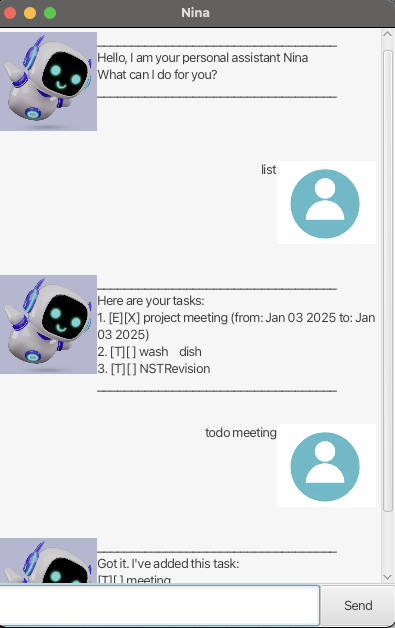

# Nina User Guide



## Introduction
>Your time is limited, so don't waste it living someone else's life.  
>--Steve Jobs  

Nina is not any chatbot, she is your **personal assistant**. Nina manages your everyday task list, and provides you short commands to make any change to the list.  

No matter you are a student, working adult, or any one trying to be productive, you will spend a great time working with Nina. Just call Nina any time through our Graphical User Interface (GUI)!

## Navigating Around 
[Features](#features)

- [add](#adding-a-task)
- [list](#listing-tasks-list)
- [mark](#marking-a-task-as-done-mark)
- [unmark](#unmarking-a-task-as-done-unmark)
- [delete](#deleting-a-task-delete)
- [find](#finding-tasks-find)

## Features
### Adding a task
Adds a task to the task list.
1. `todo`: adds a general task with description.  

Command format: `todo <task_description>`   
Example: `todo borrow book`  
Expected output:
```declarative
Got it. I've added this task: 
[T][] borrow book
Now you have 1 task in the list.
```

2. `deadline`: adds a deadline task with description and deadline date. (date format: YYYY-MM_DD)  

Command format: `deadline <task_description> /by <date>`  
Example: `deadline return book /by 2025-03-01`  
Expected output:  
```declarative
Got it. I've added this task:
[D][] return book (by: Mar 01 2025)
Now you have 2 tasks in the list.
```  
3. `event`: adds an event task with description, a specific start/from date, and a specific end/to date. (date format: YYYY-MM_DD)

Command format: `event <task_description> /from <date1> /to <date2>`  
Example: `event training /from 2025-05-02 /to 2025-05-04`  
Expected output:
```declarative
Got it. I've added this task:
[E][] training (from: May 02 2025 to: May 04 2025)
Now you have 3 tasks in the list.
```
### Listing tasks: `list`  
Shows the list containing all tasks.  
Command format: `list`  
Example: `list`  
Expected output:
```declarative
Here are your tasks:
1. [T][] borrow book
2. [D][] return book (by: Mar 01 2025)
3. [E][] training (from: May 02 2025 to: May 04 2025)
```
### Marking a task as done: `mark`  
Marks a task as done.  
Command format: `mark <task_index>`  
Example: `mark 1`  
Expected output:  
```declarative
Nice! I've marked this task as done:
[T][X] borrow book
```  
### Unmarking a task as done: `unmark` 
Unmarks a task as done when you indicate a task as done by mistake.  
Command format: `unmark <task_index>`  
Example: `unmakr 1`  
```declarative
Ok, I've marked this task as not done yet:
[T][] borrow book
```  
### Deleting a task: `delete`  
Deletes a task from the list.  
Command format: `delete <task_index>`
Example: `delete 3`  
```declarative
Noted. I've removed this task:
 [E][] training (from: May 02 2025 to: May 04 2025)  
Now you have 2 tasks in the list.
```  
### Finding tasks: `find`  
Finds tasks by searching a keyword in the task description.  
Command format: `find <keyword>`  
Example: `find book`  
Expected output:  
```declarative
Here are the matching tasks in your list:
1. [T][] borrow book
2. [D][] return book (by: Mar 01 2025)
```